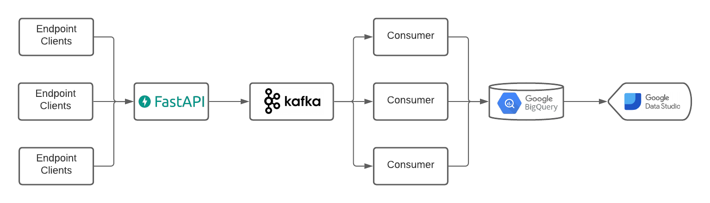

# Gatekeeper API

[](https://github.com/wikankun/gatekeeper-api/actions/workflows/fastapi.yml)
[](https://GitHub.com/wikankun/gatekeeper-api/tags/)
[](https://www.python.org/)

## Prerequisite

- Python
- Docker
- Docker Compose
- Google Cloud

## How to run

- Place your key.json from your google service account in the directory

- Setup kafka
```
docker-compose up -d
```

- Create kafka topic
```
docker-compose exec broker kafka-topics --create --bootstrap-server localhost:9092 --replication-factor 1 --partitions 1 --topic gatekeeper
```

- Create virtual environment and activate it
```
pip install virtualenv
virtualenv env
. env/bin/activate
```

- Install required packages
```
pip install -r requirements.txt
```

- Run FastAPI server
```
uvicorn app.app:app --reload
```

- Run `consumer.py`
```
python -m app.consumer
```

- Load test with locust
```
locust
```

- Unit test
```
pytest
```

- For documentation (using Swagger)
  You can also hit the API there.
```
localhost:8000/docs
```

## What does my code do?



My approach consist of three main part, API Gateway, Kafka, and Consumer.
- API Gateway
  Handles Payload from user, validate it, and send it to message queue.
- Kafka
  Acts as message queue, delivers the messages to consumer(s).
- Consumer
  Consume messages from Kafka, and store it into BigQuery Table(s). Every transaction is logged into `activity_log` table.

## Outputs

[Dashboard](https://datastudio.google.com/u/0/reporting/db4bae0c-7903-475b-a6c1-c36a349b13ce/page/XobPC)

[Load Testing Result](assets/gatekeeper_report_load_test.html)
